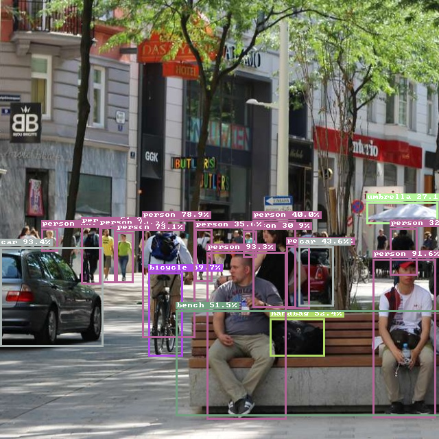
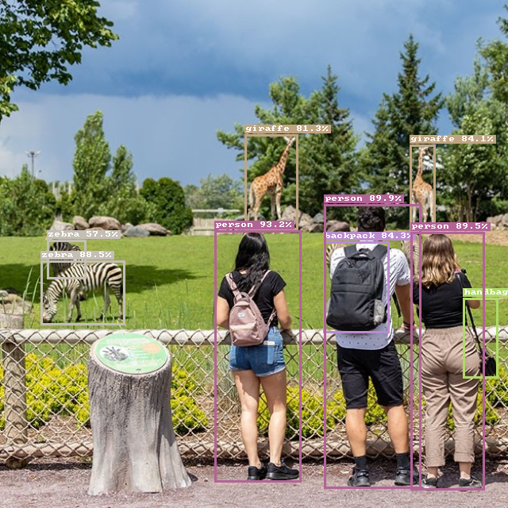
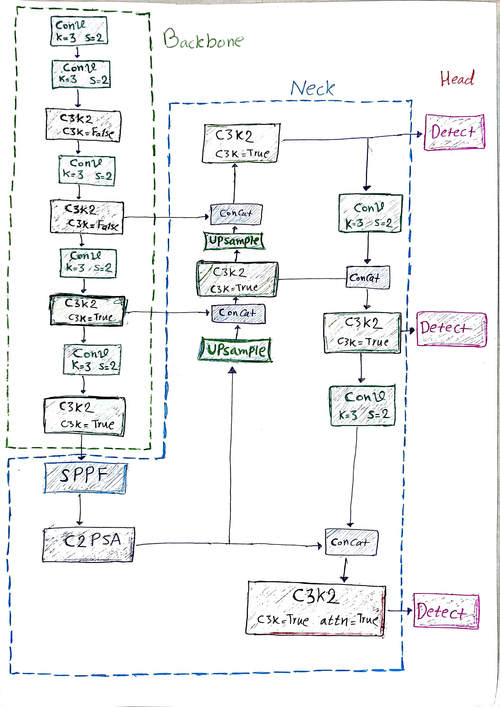
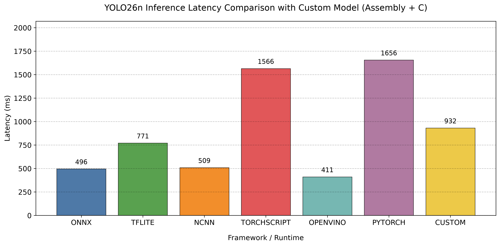
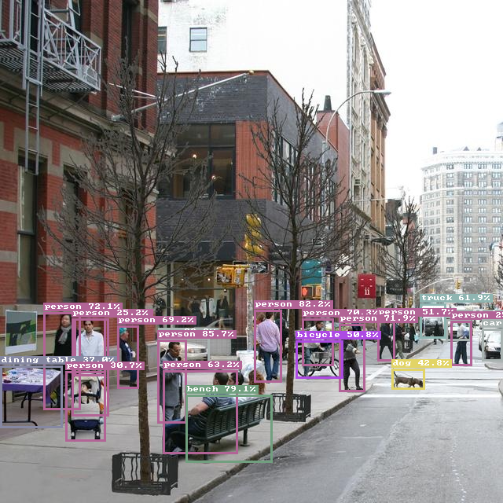
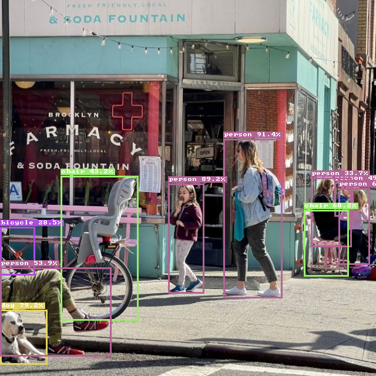

## YOLO26 Inference (ARM64 Assembly + C)

<p align="center">
  
  
</p>

<p align="center">
  <b>YOLO26 object detection inference</b> written from scratch in <b>ARM64 Assembly</b> and <b>C</b>, optimized for the <b>Raspberry Pi 4 (ARM Cortex-A72)</b>.
</p>

<p align="center">
  Bachelor's Final Project<br>
  Author: <a href="https://www.linkedin.com/in/mohammad-ghaderi-ba09a8359">Mohammad Ghaderi</a><br>
  Advisor: <a href="https://scholar.google.com/citations?user=ew1vFSsAAAAJ">Prof. Saleh Yousefi</a>
</p>

---

## Project Overview

This project implements the inference stage of the [YOLO26n](https://docs.ultralytics.com/models/yolo26#overview) object detection model entirely from scratch using C and ARM64 Assembly. The main focus is on understanding and reproducing the low-level optimizations employed by modern ARM inference engines.

Key optimization areas include:

- ARM NEON SIMD vectorization
- Cache-aware computation
- Winograd convolution
- Optimized GEMM kernels
- Operator fusion
- ARM64 micro-kernel design

---

## YOLO26 Architecture

<p align="center">
  
</p>

The implementation follows the YOLO26 architecture and focuses on efficient execution of convolutional layers on ARM Cortex-A72 processors.

---

## Features

- ARM64 (AArch64) optimized
- ARM64 Assembly + C
- ARM NEON vectorization
- Float32 inference
- SiLU/sigmoid/softmax activation <sup>(NCNN-inspired implementation - implementing exp)
- Winograd F(2×3) transform <sup> (using NCNN transform matrix values)
- GEMM convolution
- Pointwise & Depthwise convolution
- Cache-aware tiling
- Custom ARM micro-kernels
- Operator fusion
- Multiple kernel and tile-size experiments
- Attention
- Components (C3K2, SPPF, Conv, C2PSA, Detect, BottleNeck, PSA)
- read jpg and save result as png with bounding boxes

---

## Performance

All benchmarks were performed on:

- Raspberry Pi 4 Model B / ARM Cortex-A72 /ARMv8-A (64-bit) / Linux

<p align="center">
  
</p>

## Example
<p align="center">
  
  
  
  
<sub>This is the output of the implementation. It surprised me—you can test it too.
</p>


## Build & Run

Compile the project : <sup>( same for arm or x86 on QEMU emulator)</sup>
<small>
If ARM64 hardware is not available, the project can be executed through QEMU. The provided Makefile supports both native ARM64 execution and QEMU-based execution using the same commands. [Go To Install QEMU emulator](#install-qemu-emulator)
</small>

```
make
```

Run inference on an image:
```
make run IMG=path/to/image.jpg
```

Example:
```
make run IMG=images/img1.jpg

```


#### Install QEMU Emulator

Ubuntu / Debian:

```
sudo apt update
sudo apt install qemu-user qemu-user-static
```

Arch Linux:

```
sudo pacman -S qemu-user
```

Fedora:

```
sudo dnf install qemu-user-static
```


## Acknowledgments

- During development, several experimental implementations were tested. Some of these (e.g., QS8, FP16, etc.) remain in the repository but are not part of the final inference pipeline.
- The parameters from the official [YOLO26n](https://docs.ultralytics.com/tasks/detect#models) pretrained model were extracted, restructured, and repacked into a custom binary format (`param.bin`). The ordering and layout were redesigned to match the optimized memory access pattern of this ARM64 inference engine.

---

